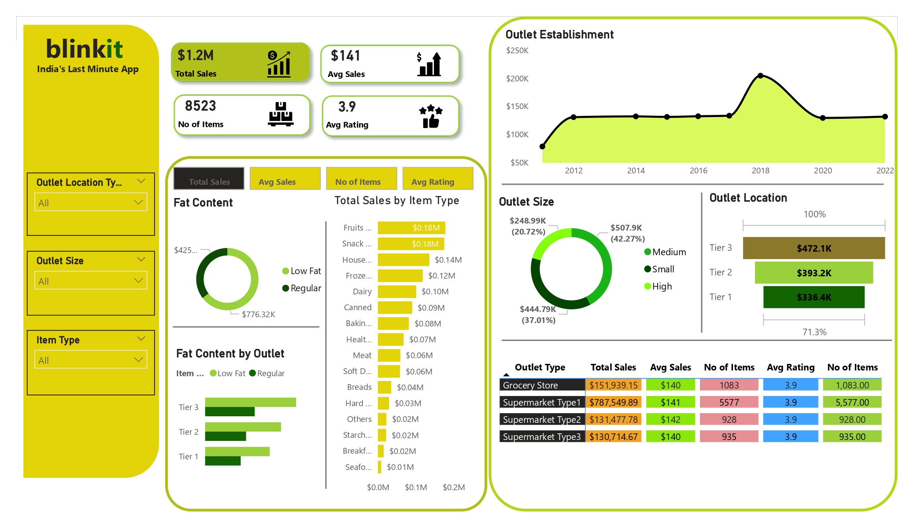
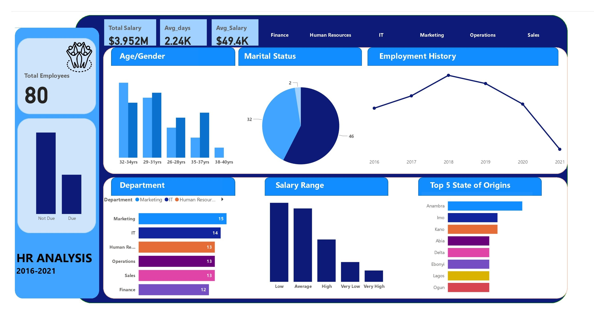

# Iranlowo Portfolio
<!--Section 1: Introduce your self-->
## ABOUT ME
Hello! I'm Iranlowo Adedoja 🤓, an entry-level data analyst, with a passion for turning data into actionable insights. With experience across sales, operations, finance, and customer service, I help businesses solve challenges and unlock growth.

<!--Mention your top/relevant skills here - core and soft skills-->
## WHAT I DO

- ✅ Data Analytics Consulting.
I provide in-depth analysis and tailored solutions to help you make data-driven decisions, optimize processes, and drive business growth. 

<!--Section 2: List 3-4 key projects-->
## MY PORTFOLIO 

A glimpse of some of the projects I've been working on.

Predictive Modeling and Hypothesis Testing using Blinkit Dataset.

It explains the Sales of a food items store over the year 2012-2022.

The best selling products and least selling products.

Fat content of the items, how they are grouped into (Low Fat, Regular).

With the store having 3 outlets

Predictive Modeling and Hypothesis Testing using Titanic Dataset.

## CONTACT DETAILS

Let’s connect and see how we can make a difference together!
<table>
  <tbody>
    <tr>
      <td>📧</td>
      <td><a href="mailto:adedojairanlowo@gmail.com">adedojairanlowo@gmail.com</a></td>
    </tr>
    <tr>
      <td>📞</td>
      <td>(234) 814-779-0063</td>
    </tr>
    <tr>
      <td>📍</td>
      <td>Lagos, Nigeria</td>
    </tr>
    <tr>
      <td>⬇</td>
      <td><a href="https://eu123456.github.io/portfolio1/docs/Profile.pdf">Download my CV</a></td>
    </tr>
    <tr>
      <td>🌐</td>
      <td><a href="[http://linkedin.com/in/iranlowo-adedoja-271793244]">My LinkedIn</a></td>
    </tr>
    <tr>
      <td>📺</td>
      <td><a 
    </tr>
  </tbody>
</table>
